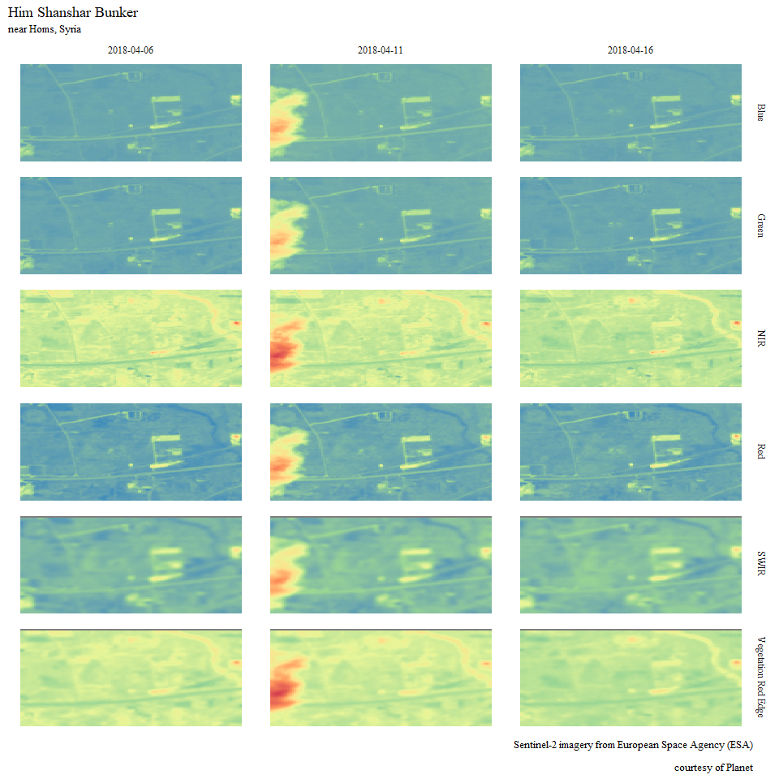
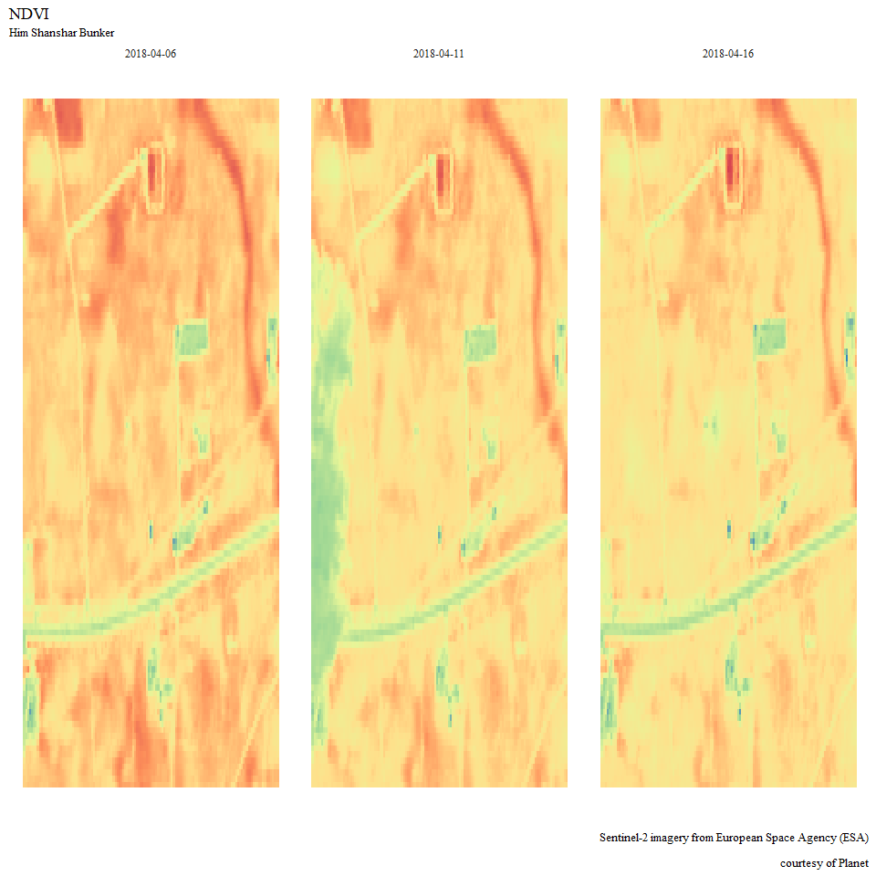
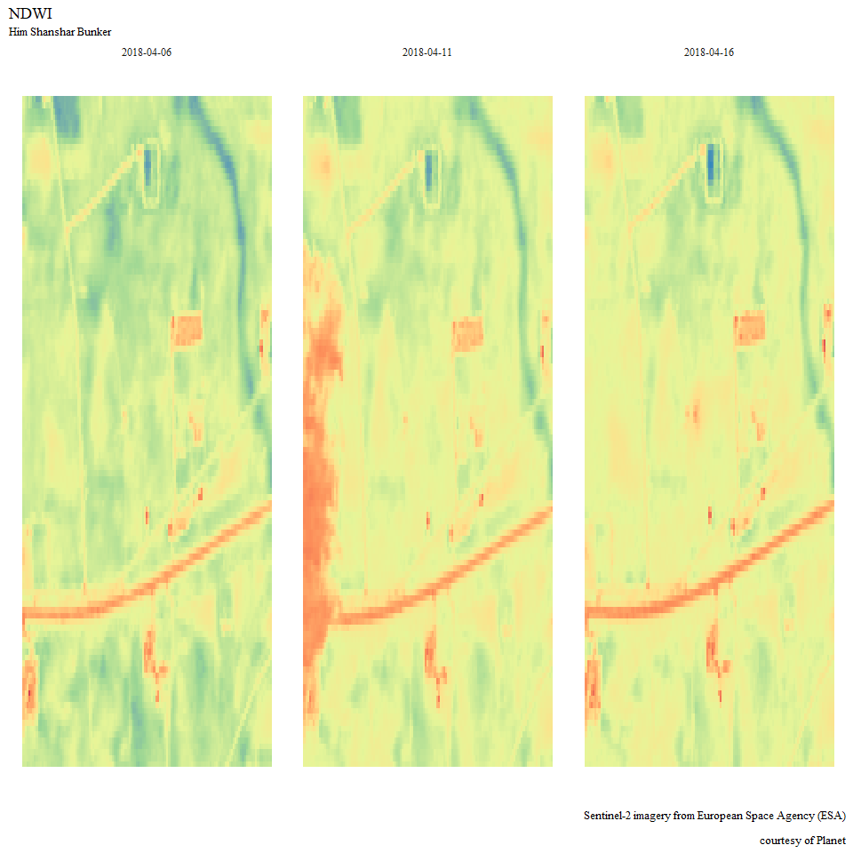

Homs Chemical Storage Facility - 2018-04-14 Missile Strikes
================
Brendan Knapp
May 6, 2018

``` r
library(raster)
library(rasterVis)
library(RStoolbox)
library(tidyverse)
library(sf)
library(units)

source("R/utils.R")
source("R/global.R")
```

``` r
shared_crs <- "+proj=utm +zone=37 +datum=WGS84 +units=m +no_defs +ellps=WGS84 +towgs84=0,0,0"


homs_2 <- "data/vector-AOIs/homs-2.kml" %>% 
  read_sf() %>% 
  st_zm() %>% 
  st_transform(shared_crs)

homs_2_buffered <- homs_2 %>% 
  st_buffer(set_units(0.25, km))

homs_bunker_entrance <- "data/vector-AOIs/homs-bunker-entrance.kml" %>% 
  read_sf() %>% 
  st_zm() %>% 
  st_transform(shared_crs)
```

``` r
image_dir %>% 
  list.files(full.names = TRUE, recursive = TRUE) %>% 
  str_subset("\\.zip$") %>% 
  walk(unzip, exdir = image_dir)
```

``` r
sentinel2_files <- image_dir %>%
  list.files(full.names = TRUE, recursive = TRUE) %>% 
  str_subset("\\.jp2$")

sentinel2_dates <- sentinel2_files %>% 
  str_extract("\\d{8}") %>% 
  unique()
```

``` r
prep_bricks <- function(date, sentinel2_files, sf_poly){
  sentinel2_files %>% 
    str_subset(date) %>% 
    map(raster) %>% 
    map(sf_crop, sf_poly) %>% 
    match_bands() %>% 
    brick() %>% 
    `names<-`(str_extract(names(.), "\\d{8}T\\d{6}\\_B\\d+A?$"))
}

bricks <- sentinel2_dates %>% 
  map(prep_bricks, sentinel2_files, homs_2_buffered)

indices <- bricks %>% 
  map(spectralIndices,
      blue = 2, green = 3, red = 4, nir = 8,
      swir2 = 11, swir3 = 12)

brick_2018_04_06 <- bricks[[2]]
brick_2018_04_11 <- bricks[[1]]
brick_2018_04_16 <- bricks[[3]]

indices_2018_04_06 <- indices[[2]]
indices_2018_04_11 <- indices[[1]]
indices_2018_04_16 <- indices[[3]]
```

``` r
tidy_rasters <- list(brick_2018_04_06, brick_2018_04_11,
                     brick_2018_04_16) %>% 
  map_df(bulk_fortify)
  
tidy_rasters %>% 
  filter(resolution <= 20) %>% 
  ggplot(aes(x, y, fill = val)) +
  geom_raster(show.legend = FALSE) +
  scale_fill_distiller(palette = "Spectral") +
  theme_minimal() +
  theme(text = element_text(family = "serif"),
        axis.text = element_blank(),
        panel.grid = element_blank()) +
  labs(x = NULL, y = NULL,
       title = "Him Shanshar Bunker",
       subtitle = "near Homs, Syria",
       caption = "Sentinel-2 imagery from European Space Agency (ESA)\n
                  courtesy of Planet") +
  facet_grid(band ~ date_name)
```



``` r
tidy_indices <- list(indices_2018_04_06, indices_2018_04_11,
                     indices_2018_04_16) %>% 
  map2_df(.y = c("2018-04-06", "2018-04-11", "2018-04-16"),
          ~ bulk_fortify(.x, indices = TRUE, date_name = .y))

tidy_indices %>% 
  filter(index == "NDVI") %>% 
  ggplot(aes(x, y, fill = val)) +
  geom_raster(show.legend = FALSE) +
  scale_fill_distiller(palette = "Spectral") +
  theme_minimal() +
  theme(text = element_text(family = "serif"),
        axis.text = element_blank(),
        panel.grid = element_blank()) +
  labs(x = NULL, y = NULL,
       title = "NDVI",
       subtitle = "Him Shanshar Bunker",
       caption = "Sentinel-2 imagery from European Space Agency (ESA)\n
                  courtesy of Planet") +
  facet_wrap(~ date_name)
```



``` r
tidy_indices %>% 
  filter(index == "NDWI") %>% 
  ggplot(aes(x, y, fill = val)) +
  geom_raster(show.legend = FALSE) +
  scale_fill_distiller(palette = "Spectral") +
  theme_minimal() +
  theme(text = element_text(family = "serif"),
        axis.text = element_blank(),
        panel.grid = element_blank()) +
  labs(x = NULL, y = NULL,
       title = "NDWI",
       subtitle = "Him Shanshar Bunker",
       caption = "Sentinel-2 imagery from European Space Agency (ESA)\n
                  courtesy of Planet") +
  facet_wrap(~ date_name)
```



``` r
devtools::session_info()
```

    ##  setting  value                       
    ##  version  R version 3.5.0 (2018-04-23)
    ##  system   x86_64, mingw32             
    ##  ui       RTerm                       
    ##  language (EN)                        
    ##  collate  English_United States.1252  
    ##  tz       America/Los_Angeles         
    ##  date     2018-05-07                  
    ## 
    ##  package      * version    date       source                              
    ##  abind          1.4-5      2016-07-21 CRAN (R 3.5.0)                      
    ##  assertthat     0.2.0      2017-04-11 CRAN (R 3.5.0)                      
    ##  backports      1.1.2      2017-12-13 CRAN (R 3.5.0)                      
    ##  base         * 3.5.0      2018-04-23 local                               
    ##  bindr          0.1.1      2018-03-13 CRAN (R 3.5.0)                      
    ##  bindrcpp     * 0.2.2      2018-03-29 CRAN (R 3.5.0)                      
    ##  broom          0.4.4      2018-03-29 CRAN (R 3.5.0)                      
    ##  caret          6.0-79     2018-03-29 CRAN (R 3.5.0)                      
    ##  cellranger     1.1.0      2016-07-27 CRAN (R 3.5.0)                      
    ##  class          7.3-14     2015-08-30 CRAN (R 3.5.0)                      
    ##  classInt       0.2-3      2018-04-16 CRAN (R 3.5.0)                      
    ##  cli            1.0.0      2017-11-05 CRAN (R 3.5.0)                      
    ##  codetools      0.2-15     2016-10-05 CRAN (R 3.5.0)                      
    ##  colorspace     1.3-2      2016-12-14 CRAN (R 3.5.0)                      
    ##  compiler       3.5.0      2018-04-23 local                               
    ##  crayon         1.3.4      2017-09-16 CRAN (R 3.5.0)                      
    ##  CVST           0.2-1      2013-12-10 CRAN (R 3.5.0)                      
    ##  datasets     * 3.5.0      2018-04-23 local                               
    ##  DBI            1.0.0      2018-05-02 CRAN (R 3.5.0)                      
    ##  ddalpha        1.3.3      2018-04-30 CRAN (R 3.5.0)                      
    ##  DEoptimR       1.0-8      2016-11-19 CRAN (R 3.5.0)                      
    ##  devtools       1.13.5     2018-02-18 CRAN (R 3.5.0)                      
    ##  digest         0.6.15     2018-01-28 CRAN (R 3.5.0)                      
    ##  dimRed         0.1.0      2017-05-04 CRAN (R 3.5.0)                      
    ##  doParallel     1.0.11     2017-09-28 CRAN (R 3.5.0)                      
    ##  dplyr        * 0.7.4      2017-09-28 CRAN (R 3.5.0)                      
    ##  DRR            0.0.3      2018-01-06 CRAN (R 3.5.0)                      
    ##  e1071          1.6-8      2017-02-02 CRAN (R 3.5.0)                      
    ##  evaluate       0.10.1     2017-06-24 CRAN (R 3.5.0)                      
    ##  forcats      * 0.3.0      2018-02-19 CRAN (R 3.5.0)                      
    ##  foreach        1.4.4      2017-12-12 CRAN (R 3.5.0)                      
    ##  foreign        0.8-70     2017-11-28 CRAN (R 3.5.0)                      
    ##  geometry       0.3-6      2015-09-09 CRAN (R 3.5.0)                      
    ##  geosphere      1.5-7      2017-11-05 CRAN (R 3.5.0)                      
    ##  ggplot2      * 2.2.1      2016-12-30 CRAN (R 3.5.0)                      
    ##  glue           1.2.0      2017-10-29 CRAN (R 3.5.0)                      
    ##  gower          0.1.2      2017-02-23 CRAN (R 3.5.0)                      
    ##  graphics     * 3.5.0      2018-04-23 local                               
    ##  grDevices    * 3.5.0      2018-04-23 local                               
    ##  grid           3.5.0      2018-04-23 local                               
    ##  gtable         0.2.0      2016-02-26 CRAN (R 3.5.0)                      
    ##  haven          1.1.1      2018-01-18 CRAN (R 3.5.0)                      
    ##  hexbin         1.27.2     2018-01-15 CRAN (R 3.5.0)                      
    ##  hms            0.4.2      2018-03-10 CRAN (R 3.5.0)                      
    ##  htmltools      0.3.6      2017-04-28 CRAN (R 3.5.0)                      
    ##  httr           1.3.1      2017-08-20 CRAN (R 3.5.0)                      
    ##  ipred          0.9-6      2017-03-01 CRAN (R 3.5.0)                      
    ##  iterators      1.0.9      2017-12-12 CRAN (R 3.5.0)                      
    ##  jsonlite       1.5        2017-06-01 CRAN (R 3.5.0)                      
    ##  kernlab        0.9-26     2018-04-30 CRAN (R 3.5.0)                      
    ##  knitr          1.20.2     2018-04-28 local                               
    ##  labeling       0.3        2014-08-23 CRAN (R 3.5.0)                      
    ##  lattice      * 0.20-35    2017-03-25 CRAN (R 3.5.0)                      
    ##  latticeExtra * 0.6-28     2016-02-09 CRAN (R 3.5.0)                      
    ##  lava           1.6.1      2018-03-28 CRAN (R 3.5.0)                      
    ##  lazyeval       0.2.1      2017-10-29 CRAN (R 3.5.0)                      
    ##  lubridate      1.7.4      2018-04-11 CRAN (R 3.5.0)                      
    ##  magic          1.5-8      2018-01-26 CRAN (R 3.5.0)                      
    ##  magrittr       1.5        2014-11-22 CRAN (R 3.5.0)                      
    ##  MASS           7.3-49     2018-02-23 CRAN (R 3.5.0)                      
    ##  Matrix         1.2-14     2018-04-13 CRAN (R 3.5.0)                      
    ##  memoise        1.1.0      2017-04-21 CRAN (R 3.5.0)                      
    ##  methods      * 3.5.0      2018-04-23 local                               
    ##  mnormt         1.5-5      2016-10-15 CRAN (R 3.5.0)                      
    ##  ModelMetrics   1.1.0      2016-08-26 CRAN (R 3.5.0)                      
    ##  modelr         0.1.1      2017-07-24 CRAN (R 3.5.0)                      
    ##  munsell        0.4.3      2016-02-13 CRAN (R 3.5.0)                      
    ##  nlme           3.1-137    2018-04-07 CRAN (R 3.5.0)                      
    ##  nnet           7.3-12     2016-02-02 CRAN (R 3.5.0)                      
    ##  parallel       3.5.0      2018-04-23 local                               
    ##  pillar         1.2.2      2018-04-26 CRAN (R 3.5.0)                      
    ##  pkgconfig      2.0.1      2017-03-21 CRAN (R 3.5.0)                      
    ##  plyr           1.8.4      2016-06-08 CRAN (R 3.5.0)                      
    ##  prodlim        2018.04.18 2018-04-18 CRAN (R 3.5.0)                      
    ##  psych          1.8.3.3    2018-03-30 CRAN (R 3.5.0)                      
    ##  purrr        * 0.2.4      2017-10-18 CRAN (R 3.5.0)                      
    ##  R6             2.2.2      2017-06-17 CRAN (R 3.5.0)                      
    ##  raster       * 2.6-7      2017-11-13 CRAN (R 3.5.0)                      
    ##  rasterVis    * 0.44       2018-04-05 CRAN (R 3.5.0)                      
    ##  RColorBrewer * 1.1-2      2014-12-07 CRAN (R 3.5.0)                      
    ##  Rcpp           0.12.16    2018-03-13 CRAN (R 3.5.0)                      
    ##  RcppRoll       0.2.2      2015-04-05 CRAN (R 3.5.0)                      
    ##  readr        * 1.1.1      2017-05-16 CRAN (R 3.5.0)                      
    ##  readxl         1.1.0      2018-04-20 CRAN (R 3.5.0)                      
    ##  recipes        0.1.2      2018-01-11 CRAN (R 3.5.0)                      
    ##  reshape2       1.4.3      2017-12-11 CRAN (R 3.5.0)                      
    ##  rgdal          1.2-18     2018-03-17 CRAN (R 3.5.0)                      
    ##  rgeos          0.3-26     2017-10-31 CRAN (R 3.5.0)                      
    ##  rlang          0.2.0      2018-02-20 CRAN (R 3.5.0)                      
    ##  rmarkdown      1.9        2018-03-01 CRAN (R 3.5.0)                      
    ##  robustbase     0.93-0     2018-04-24 CRAN (R 3.5.0)                      
    ##  rpart          4.1-13     2018-02-23 CRAN (R 3.5.0)                      
    ##  RPostgreSQL    0.6-2      2017-06-24 CRAN (R 3.5.0)                      
    ##  rprojroot      1.3-2      2018-01-03 CRAN (R 3.5.0)                      
    ##  RStoolbox    * 0.2.1      2018-05-03 Github (bleutner/RStoolbox@7e6cbf3) 
    ##  rstudioapi     0.7        2017-09-07 CRAN (R 3.5.0)                      
    ##  rvest          0.3.2      2016-06-17 CRAN (R 3.5.0)                      
    ##  scales         0.5.0      2017-08-24 CRAN (R 3.5.0)                      
    ##  sf           * 0.6-3      2018-05-03 Github (r-spatial/sf@9439e11)       
    ##  sfsmisc        1.1-2      2018-03-05 CRAN (R 3.5.0)                      
    ##  sp           * 1.2-7      2018-01-19 CRAN (R 3.5.0)                      
    ##  spData         0.2.8.3    2018-03-25 CRAN (R 3.5.0)                      
    ##  splines        3.5.0      2018-04-23 local                               
    ##  stats        * 3.5.0      2018-04-23 local                               
    ##  stats4         3.5.0      2018-04-23 local                               
    ##  stringi        1.1.7      2018-03-12 CRAN (R 3.5.0)                      
    ##  stringr      * 1.3.0      2018-02-19 CRAN (R 3.5.0)                      
    ##  survival       2.41-3     2017-04-04 CRAN (R 3.5.0)                      
    ##  tibble       * 1.4.2      2018-01-22 CRAN (R 3.5.0)                      
    ##  tidyr        * 0.8.0      2018-01-29 CRAN (R 3.5.0)                      
    ##  tidyselect     0.2.4      2018-02-26 CRAN (R 3.5.0)                      
    ##  tidyverse    * 1.2.1.9000 2018-05-05 Github (tidyverse/tidyverse@83f6ec3)
    ##  timeDate       3043.102   2018-02-21 CRAN (R 3.5.0)                      
    ##  tools          3.5.0      2018-04-23 local                               
    ##  udunits2       0.13       2016-11-17 CRAN (R 3.5.0)                      
    ##  units        * 0.5-1      2018-01-08 CRAN (R 3.5.0)                      
    ##  utils        * 3.5.0      2018-04-23 local                               
    ##  viridisLite    0.3.0      2018-02-01 CRAN (R 3.5.0)                      
    ##  withr          2.1.2      2018-04-30 Github (jimhester/withr@79d7b0d)    
    ##  XML            3.98-1.11  2018-04-16 CRAN (R 3.5.0)                      
    ##  xml2           1.2.0      2018-01-24 CRAN (R 3.5.0)                      
    ##  yaml           2.1.19     2018-05-01 CRAN (R 3.5.0)                      
    ##  zoo            1.8-1      2018-01-08 CRAN (R 3.5.0)
